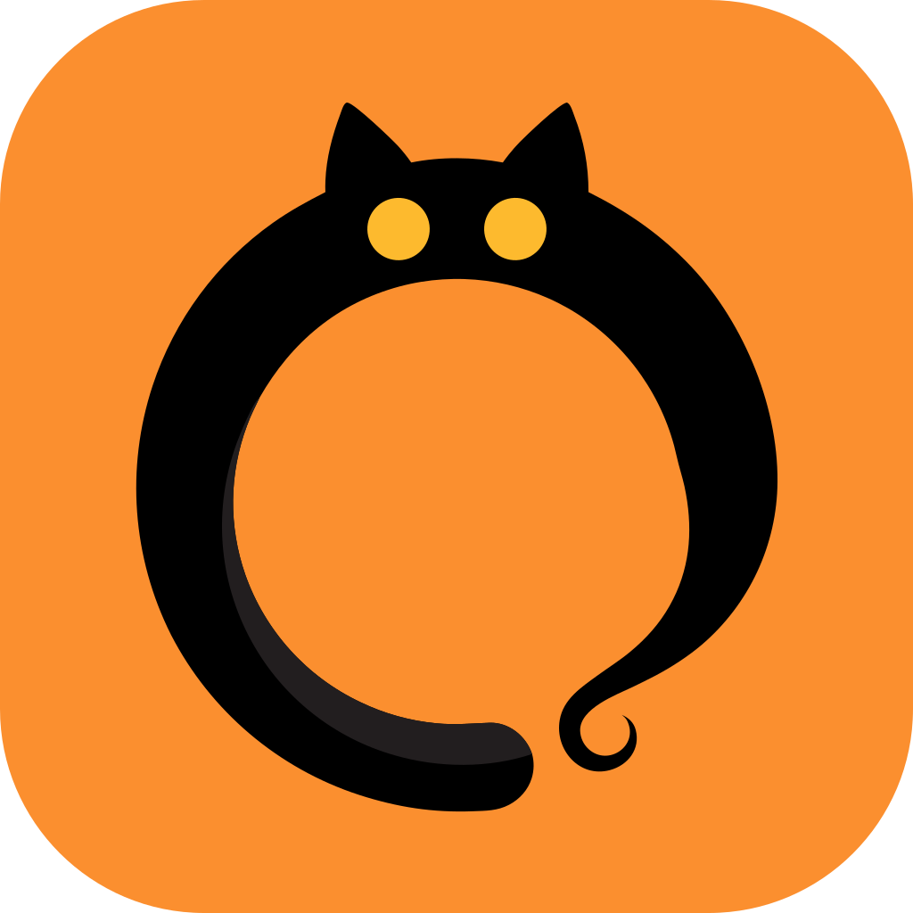
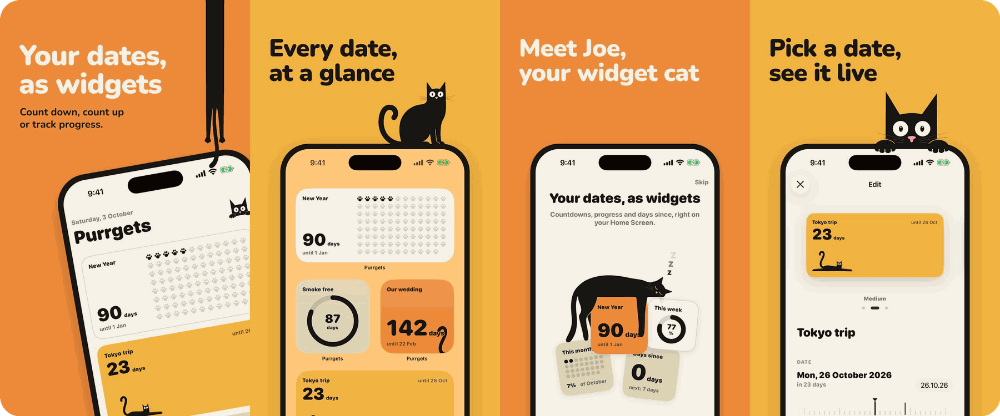

<p align="center">
  
</p>

<h1 align="center">Purrgets</h1>

<p align="center">
  Countdown, time-since and progress widgets for iPhone and Mac, with a cat named Joe living in them.
</p>

<p align="center">
  <a href="https://apps.apple.com/app/id6818740758"></a>
  
  
  
  
</p>

<p align="center">
  <a href="#features">Features</a> ·
  <a href="#architecture">Architecture</a> ·
  <a href="#getting-started">Getting started</a> ·
  <a href="https://drahanov.github.io/purrgets/privacy.html">Privacy</a>
</p>

<p align="center">
  
</p>

## Features

- **Three tracker types**: countdown to a date, days since something began, and progress through a year, month, week or custom range.
- **Five widget styles**: Number, Ring, Dot grid (circles, squares or paws), Bar and Long cat, whose body stretches as time passes.
- **Every widget size that matters**: Small and Medium on the Home Screen and desktop, plus circular, rectangular and inline on the Lock Screen.
- **Live editor**: the widget preview updates as you edit, and a day scrubber shows how it will look on any date.
- **Start fast**: a template library (holidays, this year, this month…) and import from Calendar.
- **Joe drops by**: on milestone days and a few random days a week, the cat peeks, hangs or sleeps on your widget.
- **A real Mac app**: sidebar window, native editor sheet, menu bar extra and desktop widgets, not a stretched phone UI.
- **Private by design**: no account, no tracking, no network. Data stays on the device.

## Tech stack

| Layer | Technology |
|---|---|
| Shared logic | Kotlin Multiplatform 2.4, kotlinx-datetime, kotlinx-serialization |
| UI | SwiftUI (iOS 18, macOS 15) |
| Widgets | WidgetKit + App Intents (per-widget tracker picker) |
| Calendar import | EventKit, wrapped behind a Kotlin `CalendarSource` |
| Project generation | XcodeGen (`apple/project.yml`) |
| Tests | `kotlin.test` on JVM, iOS Simulator and macOS; XCTest unit and snapshot tests |

## Architecture

All date maths, timeline planning and storage live in one Kotlin framework that both the app and the widget extension link. Swift only draws.


<details>
<summary>Data flow</summary>


</details>

### Engineering highlights

- **Widgets that stay correct without waking up.** iOS gives a widget roughly 40–70 reloads a day. `TimelinePlanner` computes every moment the widget must change (midnight, milestones, a cat arriving or leaving) and hands WidgetKit the whole day's frames in one go.
- **Deterministic cameos.** Joe's visits are seeded by tracker id + date, so the app preview, the widget and every reload agree on when and where he appears, with no stored state.
- **Invalid states don't compile.** A tracker's kind (`Countdown`, `TimeSince`, `Progress`) is a sealed type, and each kind has its own sealed style type, so a "time since" tracker can't be given a bar or long-cat style.
- **Floating dates.** A date like 15 Dec stays 15 Dec when you travel. A time zone is stored only for exact times.
- **Crash-safe storage.** One versioned `trackers.json` in the App Group, written via temp file + rename, with schema migrations. An unreadable file is set aside rather than overwritten.
- **One writer.** Only the app writes; widgets only read. No cross-process locking needed.
- **Vector cat, animated in code.** The cat art is generated into SwiftUI paths (`concept/cats/source/swift_gen.py`), and `CatWarp` is an animatable stretch, so the long cat grows smoothly inside a widget.

<details>
<summary>Key decisions</summary>

| | Choice | Why |
|---|---|---|
| Logic | Kotlin Multiplatform | One tested core, reusable on Android later |
| UI | SwiftUI | WidgetKit requires it |
| Storage | One `trackers.json` in the App Group | Tiny data, and the widget stays light |
| Writes | App only | No two processes writing one file |
| Widget updates | Frames planned ahead (midnight, milestones) | iOS allows ~40–70 reloads a day |
| Dates | Floating by default | "15 Dec" stays 15 Dec when you travel |
| DI | Constructor injection, no framework | Small graph |
| Sync | Not in v1 | Keep v1 simple |

</details>

## Project structure

```
Purrgets/
├── domain/        Pure Kotlin: model, calculators, TrackerEngine, TimelinePlanner, use cases
├── data/          JSON repository + migrations, template library, EventKit calendar source
├── sharedLogic/   Builds the SharedLogic framework for Apple; AppContainer (DI root)
├── apple/
│   ├── App/       SwiftUI app: home, editor, onboarding, add-widget guide, Mac UI, settings
│   ├── Widget/    WidgetKit extension (timeline provider, widget configuration)
│   ├── Shared/    Code used by app and widget: widget views, cat art, Kotlin bridge
│   ├── AppTests/  View model and editor tests
│   └── Tests/     Widget snapshot tests
├── docs/          Diagrams, app icon, privacy and support pages (GitHub Pages)
└── androidApp/, desktopApp/, sharedUI/   KMP template targets, kept for a future Android version
```

## Getting started

Requirements: Xcode 26, a JDK with `JAVA_HOME` set, [XcodeGen](https://github.com/yonaskolb/XcodeGen).

```sh
# Generate the Xcode project
cd apple && xcodegen

# Open it and run the PurrgetsiOS or PurrgetsMac scheme
open Purrgets.xcodeproj
```

The Kotlin framework is built automatically by a build phase in Xcode.

### Tests

```sh
# Kotlin: domain + data on JVM, iOS Simulator and macOS
./gradlew :domain:allTests :data:allTests
```

- Swift unit tests: run the `PurrgetsAppTests` target.
- Widget snapshots: run the `PurrgetsSnapshotTests` scheme. Set `TEST_RUNNER_RECORD_SNAPSHOTS=1` to re-record.

### Regenerating docs

```sh
python3 docs/diagrams/build.py   # architecture and data-flow diagrams
```

## License

Code is released under the [MIT License](LICENSE). The Purrgets name, app icon, Joe and all cat artwork are not covered and remain all rights reserved.

## Author

Made by [@Drahanov](https://github.com/Drahanov).
