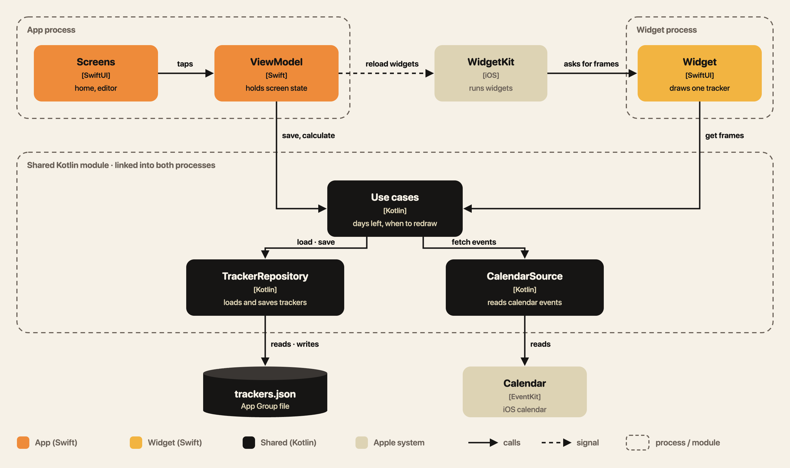
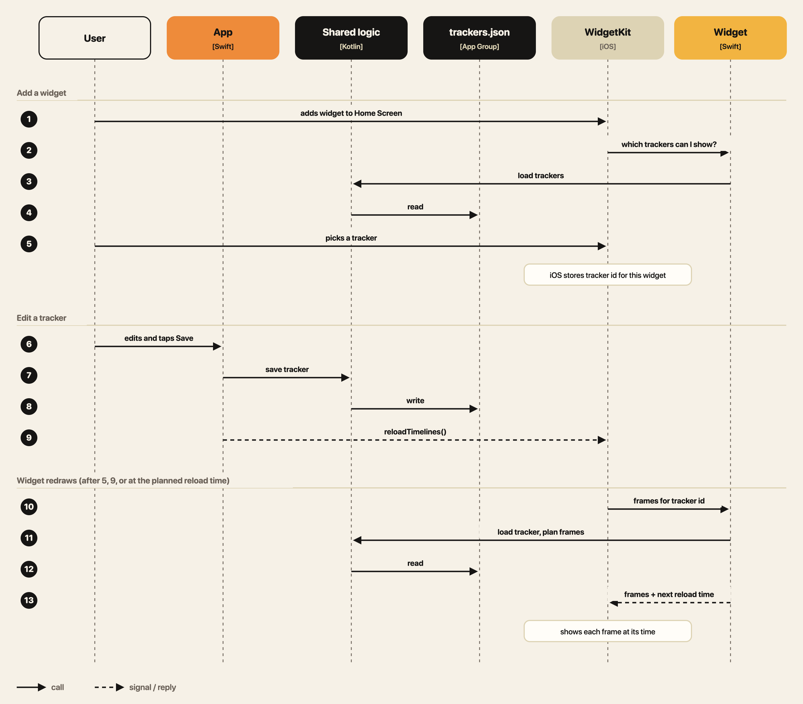

# Purrgets

Countdown and progress widgets for iPhone and Mac, with cats.
Kotlin Multiplatform for the logic, SwiftUI + WidgetKit for the UI.

## Architecture

## Data flow

## Decisions

| | Choice | Why |
|---|---|---|
| Logic | Kotlin Multiplatform | One tested core, reusable on Android later |
| UI | SwiftUI | WidgetKit requires it |
| Storage | One `trackers.json` in the App Group | Tiny data, and the widget stays light |
| Writes | App only | No two processes writing one file |
| Widget updates | Frames planned ahead (midnight, milestones) | iOS allows ~40–70 reloads a day |
| Dates | Floating by default | "15 Dec" stays 15 Dec when you travel |
| DI | Constructor injection, no framework | Small graph |
| Sync | Not in v1 | Keep v1 simple |

## Run

- iOS: open `iosApp` in Xcode
- Tests: `./gradlew :sharedLogic:jvmTest`
- Diagrams: `python3 docs/diagrams/build.py`
